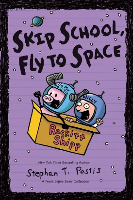
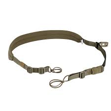
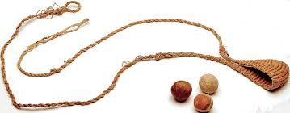
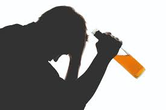

[YouTube Link to Enjoy it](https://www.youtube.com/watch?v=tQP2Iow-4ZA)

- When it was 1992
- Two little kids stealing records, **skipping school**
- We must have been like only ten
- **Taking life for granted** 'til we learned it had an end
(Remember when)
- Time is something they say
- You never appreciate till you age
- Until this day you never knew
- I wanted to be just like you
- If I only knew
- Then what I know now
- Then what I know now
- If I only knew
- Then what I know now
- Then what I know now
- When it was 2002
- You started **slinging** **coke** and got the **dopest** pair of shoes
- We owe this house a state of home
- Since our father **hit the bottle** and our mother **hit the road**
- Time is something they say
- You never understand until it **slips away**
- And looking back I think you knew
- I wanted to be just like you
- If I only knew
- Then what I know now
- Then what I know now
- If I only knew
- Then what I know now
- Then what I know now
- And now I'm tired of the violence
- I'm so tired of the silence
- And it's better me, better me than you
- Now I'm tired of the violence
- I'm so tired of the silence
- And it's better me, better me than you
- Slipping and we're falling
- We're falling through ice
- Slipping and we're falling
- Don't know where we're going with our lives
- If I only knew
- Then what I know now
- Then what I know now
- If I only knew
- Then what I know now
- Then what I know now
- Now I'm tired of the violence
- I'm so tired of the silence
- And it's better me, better me than you
- Now I'm tired of the violence
- I'm so tired of the silence
- And it's better me, better me than you
- slipping and we're falling
- We're falling through ice
- Slipping and we're falling
- Don't know where we're going with our lives
- Slipping and we're falling
- And we're falling through ice

### NEW WORDS

#### Skipping school

#### Taking something (life) for granted
to never think about something because you believe it will always be available or stay exactly the same

(Example)
1. I took it for granted that I would find the perfect job.
2. It’s easy to take your parents for granted.

#### Sling
(noun) a flexible strap or belt used in the form of a loop to support or raise a hanging weight. | a simple weapon in the form of a strap or loop, used to hurl stones or other small missiles.

(verb)
casually throw or fling.

#### Hit the bottle
start to drink alcohol heavily.

#### Hit the road
to leave a place or begin a journey

(Example)
- I'd love to stay longer but I must be hitting the road.

#### Slip away
to leave secretly