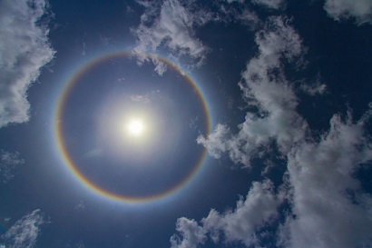
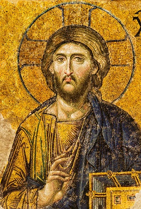
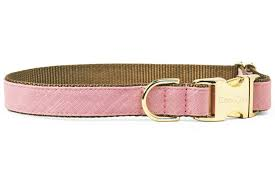
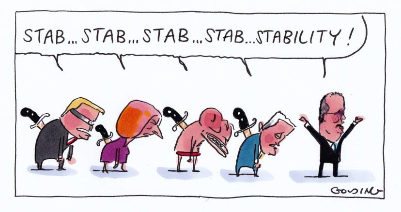
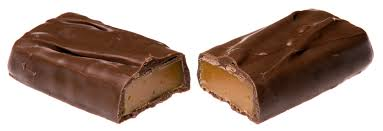
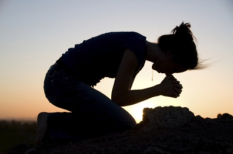
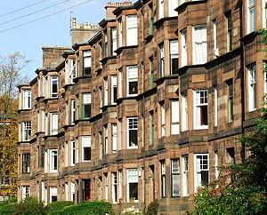

[YouTube Link to Enjoy it](https://www.youtube.com/watch?v=u9Dg-g7t2l4)

- Hello darkness, my old friend
- I've come to talk with you again
- Because a vision softly creeping
- Left its seeds while I was sleeping
- And the vision that was planted in my brain
- Still remains
- Within the sound of silence
- In restless dreams I walked alone
- Narrow streets of cobblestone
- 'Neath the **halo** of a street lamp
- I turned my **collar** to the cold and damp
- When my eyes were **stabbed** by the flash of a neon light
- That **split** the night
- And touched the sound of silence
- And in the **naked light**, I saw
- Ten thousand people, maybe more
- People talking without speaking
- People hearing without listening
- People writing songs that voices never share
- And no one dared
- Disturb the sound of silence
- "Fools", said I, "You do not know
- Silence like a cancer grows
- Hear my words that I might teach you
- Take my arms that I might reach you"
- But my words, like silent raindrops fell
- And echoed
- In the wells of silence
- And the people **bowed** and prayed
- To the neon god they made
- And the sign flashed out its warning
- In the words that it was forming
- And the sign said, "The words of the prophets are written on the subway walls
- And **tenement** halls"
- And whispered in the sound of silence

---
## NEW WORDS
---
#### Halo
a disk or circle of light shown surrounding or above the head of a saint or holy person to represent their holiness | a circle of white or colored light around the sun, moon, or other luminous body caused by refraction through ice crystals in the atmosphere

---

#### collar
a band of material around the neck of a shirt, dress, coat, or jacket, either upright or turned over and generally an integral part of the garment

---

#### stab
(in this song) cause a sudden sharp sensation | thrust a knife or other pointed weapon into (someone) so as to wound or kill

---

#### split
divide into two or more groups

---

#### bow
bend the head or upper part of the body as a sign of respect, greeting, or shame

---

#### tenement
a room or a set of rooms forming a separate residence within a house or block of apartments

A tenement is a type of building shared by multiple dwellings, typically with flats or apartments on each floor and with shared entrance stairway access, on the British Isles notably common in Scotland (From WIKIPEDIA).

