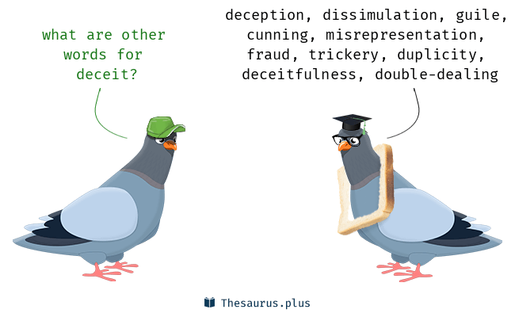
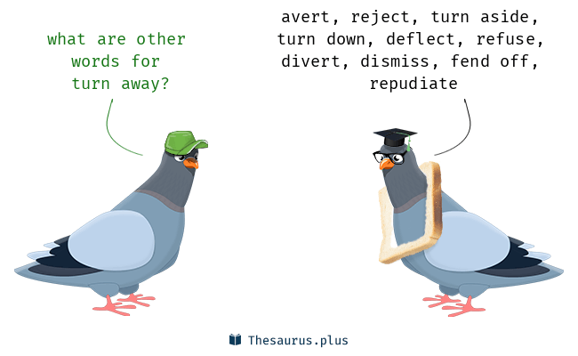
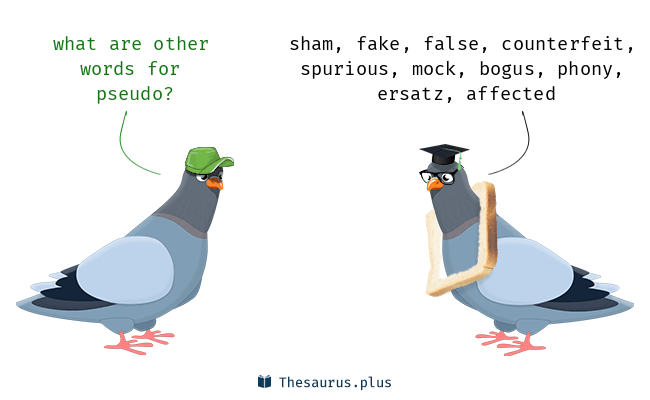
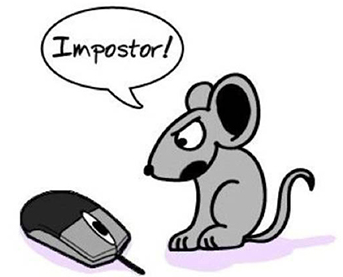
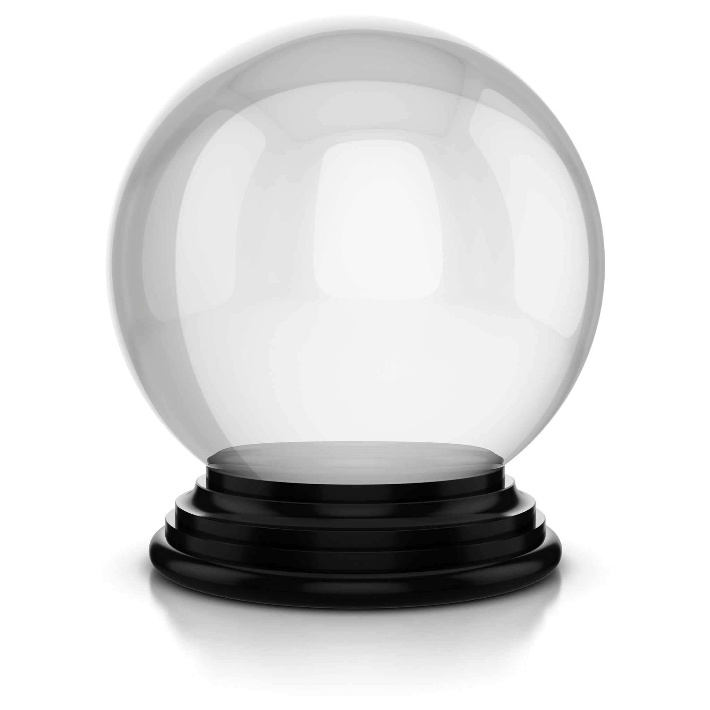
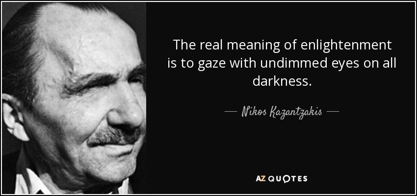
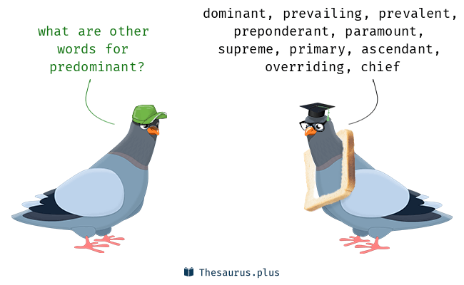
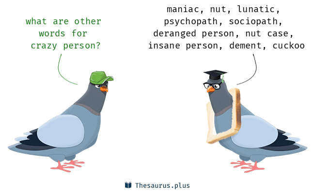
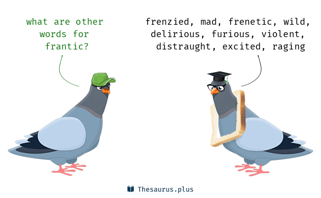
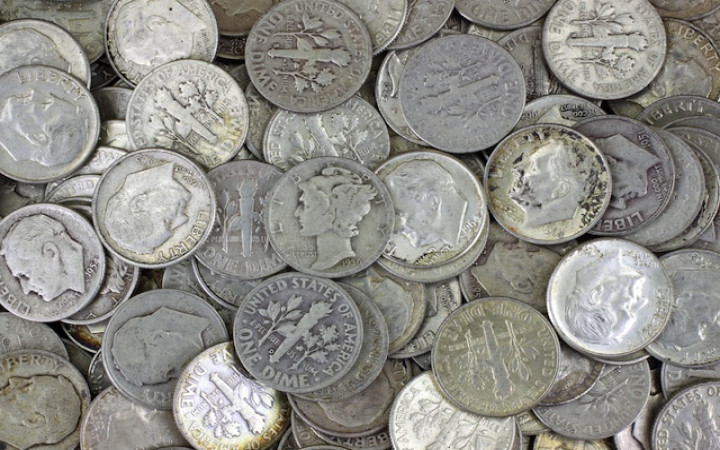

# Episode 1
- Our true wealth is our time and freedom. Money is just a tool for trading our time.
- The best investment that everyone can make in his lifetime is his own education. Education on the history of money. Education on finance. Education on how the global economy works. Education on how the central bankers, the stock market etc. can cheat us, how they can scam us.
- **Winston Churchill**: "The further you look into the past, the further that you can see into the future."
- The way the monetary system works is something that isn't actually hidden away from all of us. It's out in the open, but it's complex and people just don't, they can't see how it works. It's hard for them to imagine that we're living in such a **hoax**.
- Roughly 5,000 years ago, the Egyptian started using gold and silver as their **predominant** from of currency, but it was not yet money. The pieces of gold and silver that they were using were odd sizes and weights. Odd purities. So, it still was not interchangable where each unit is the same as the next. This meant that nothing really had a price yet. They couldn't put a price of so many coins on something because they didn't have coins yet. Trade was still difficult. It was a kind of guessing game when it came to exchange the values.
- **The difference between currency and money**: Money must be a store of value and maintain its purchasing power over long periods of time.
- In fact, national currencies are really a tool used by the government and the financial sector to **leach away** your time and you freedom by stealing your purchasing power. So, rather than storing our economic energy, currencies leak.
- Gold is only formed when a star explodes, a supernova, and it stays around forever. This is one of the properties that makes it the ultimate money.
- Governments dislike gold because they fear the gold constrain their ability to spend beyond its means.
- **Inflation** is an expansion of the currency supply. If the currency supply is increased, the prices will rise.
- **Deflation** is a contraction of the currency supply. Prices will fall when the currency supply is decreased.
- But, in fact nothing happens in real world, prices don't rise. The only true phenomenon is that the currency goes down.

### Deceit
The action or practice of deceiving someone by concealing or mispresenting the truth

#### Synonyms
1. deception
2. duplicity
3. double-dealing
4. fraud
5. fraudulence
6. cheating
7. trickery
8. duping

(Adj) deceitful

(Example)
- The whole world is **turned away** from real money and has been fooled into using currency, a deceitful **imposter** that is silently stealing your two most valuable assets.

### turn away
- refuse to allow someone to enter a place.
- start to move away or to face in a different direction

### imposter
a person who pretends to be someone else in order to deceive others, especially for fraudulent gain.

### crystalball
1. A glass or crystal orb used by fortune-tellers and mystics in popular culture to see into the future.
2. By extension, any figurative means of predicting future events.

(Example)
- She must have some kind of crystal ball for the economy, because every business decision she's made has been timed perfectly to market fluctuations.

### gaze
a steady intent look.

(Example)
- He could only gaze at her in astonishment.
- Nobody is able to gaze into the future except whoever posses a real crystalball.

### hoax
a humorous or malicious deception

(Synonyms)
1. joke
2. jest
3. trick
4. deception
5. scam
6. cheat
7. prank

(Example)
- They recognized the plan as a hoax.

### predominant
present as the strongest or main element

(Synonym)
1. main
2. chief
3. principal
4. most important
5. of great importance
6. key
7. prime
8. uppermost
9. leading
10. foremost

(Example)
- It's predominant color was white.

### leach away
to remove something from somebody

### nut
Nut is a slang term for a crazy or eccentric person or a fan of someone or something. An example of a nut is a person who yells at the top of their lungs for no reason in public places.

### To be on the right track

### barter
exchange (goods or services) for other goods or services without using money.

(Example)
- He often bartered a meal for drawings.
- Before we had currencies, we had barter.

### voodoo, hocus pocus
unnecessaringly mysterious or elaborate activity or talk to cover up a deception, magnify a simple purpose, etc.

### franticness
Noun from frantic (adj) meaning -> emotionally out of control

### an utter chaos
- utter = complete
- chaos = complete disorder and confusion

### dime

(Example)
- All merchants have a common characteristic, they just want to get every last dime out of you.

### to get fleeced
obtain a great deal of money from (someone), typically by overcharging or swindling (= use deception to deprive (someone) of money or possessions) them.

(Example)
- money that authorities say he fleeced from well-to-do acquaintances
- You get fleeced by the merchants to the point where you come back with an empty wallet.

### bailout
an act of giving financial assistance to a failing business or economy to save it from collapse.