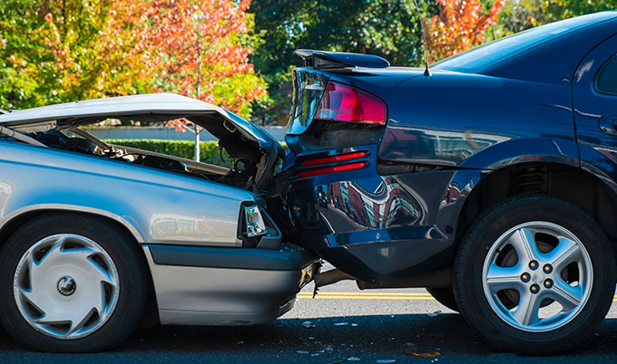
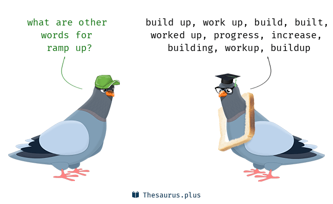

# Episode 3
- Every 30 to 40 years, the world has a new monetary system.
- These new currency systems are always created by the same idiots that created the last one that fell apart.
- It's banks, central banks, and governments that are creating these new systems each time, and each time the system they come up with is a system that cheats the population more and enriches the government and the banks more. It is just a transfer of wealth from people to banks and governments that happen very fast.
- There were more millionares created during the great depression than any other period in U.S History.

### go on stage
to have a presentation

(Example)
- I'm about to go on stage in just a few minutes.

### birthright
a particular right of possession or privilege one has from birth, especially as an eldest child.

(Example)
- Education is the birthright of every child.

(Synonyms)
1. patrimony
2. inheritance
3. heritage
4. right
5. due
6. privilege

### fender-bender
a road accident in which the vehicles involved are only slightly damaged | a minor automobile accident.

(Example)
- I was in a little fender-bender a while back and so I took a little bit of time off.

### handicap
a circumstance that makes progress or success difficult.

(Examples)
- A criminal conviction is a handicap and a label that may stick forever.
- Lack of funding has handicapped the development of research.

### dyslexic
Dyslexia is a learning disorder that involves difficulty reading due to problems identifying speech sounds and learning how they relate to letters and words (decoding). Also called reading disability, dyslexia affects areas of the brain that process language.

### to be wired differently

(Example)
- My brain's wired a little bit differently.

### pump into
to invest a lot of money in something

(Example)
- She wants to pump money into her local football team.

### repatriation
the return of someone to their own country

(Example)
- The voluntary repatriation of refugees.
- Americans have gold repatriation.

### first nail in the coffin of another thing
If you say that one thing is a nail in the coffin of another thing, you mean that it will help bring about its end or failure.

(Example)
- A fine would be the final nail in the coffin of the airline.
- This latest evidence could be the final nail in the coffin for Jackson's case.

### sacrosanct
too important to be changed or destroyed

(Example)
- Human life is sacrosanct.

### doomsday
the end of the world, or a time when something very bad will happen

(Example)
- Ecologists predict a doomsday scenario (= a time when death and destruction will happen) if global warming continues to increase at the present rate.
- You could talk till/until doomsday (= for a very long time), but they will never change their minds.

### ramp up
to increase the level or amount of something sharply.

(Example)
- They ramped up production to meet booming demand.

### dow
is a stock market index that measures the stock performance of 30 large companies listed on stock exchanges in the United States.