# Episode 1
### nurture
care for and encourage the growth or development of.

(Example)
- For generations, this stable eden nurtured our growing civilization.

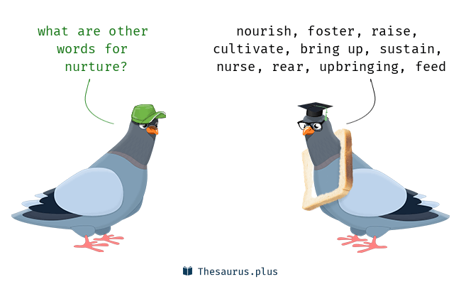

### resilient
able to withstand or recover quickly from difficult conditions

(Synonyms)
1. strong
2. tough
3. hardy
4. quick to recover
5. quick to bounce back
6. difficult to keep down
7. adaptable

(Example)
- Babies are generally far more resilient than new parents realize.
- The natural world is resilient. Great riches still remain, and with our help, planet can recover.

### flourish
(of a person, animal, or other living organism) grow or develop in a healthy or vigorous way, especially as the result of a particularly favorable environment.

(Synonyms)
1. grow
2. thrive
3. prosper
4. burgeon
5. proliferate
6. spring up
7. shoot up
8. bloom
9. blossom
10. burst forth

(Example)
- Wild plants flourish on the banks of the lake.
- Wildlife still flourishes in astonishing numbers in a few precious places.

### congregate
gather into a crowd or mass

(Synonyms)
1. assemble
2. gather
3. collect
4. come together
5. flock together
6. get together
7. convene
8. throng
9. foregather

(Example)
- Some 4000 demonstrators had congregated at a border point.
- Along the Peruvian coast of South America, seabirds congregate in colonies millions strong.

### booby

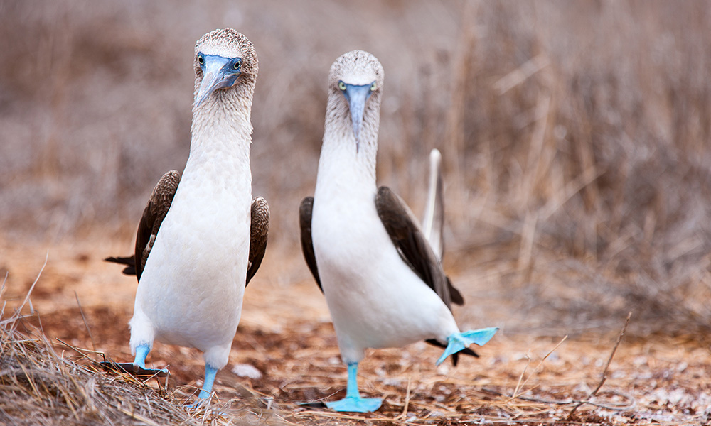

### cormorant

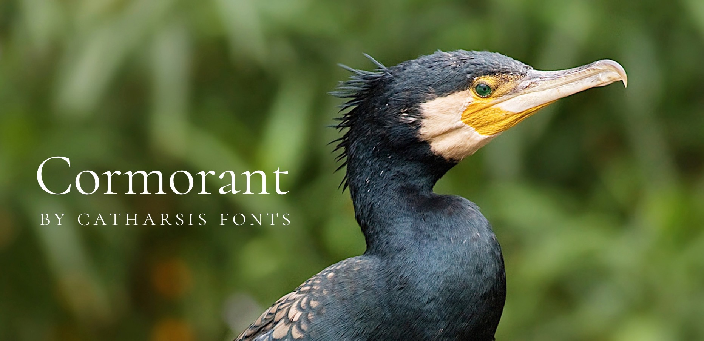

### anchovy

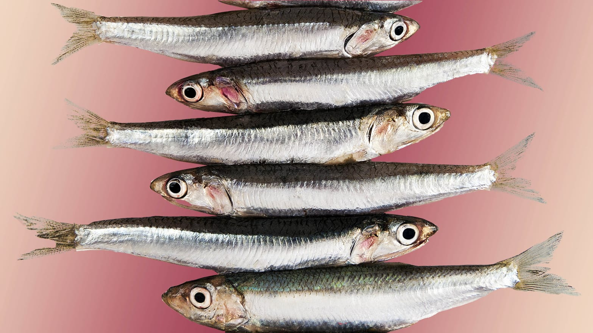

### carpet bombing

### shoal
1. a large number of fish swimming together.
2. an area of shallow water, especially as a navigational hazard.

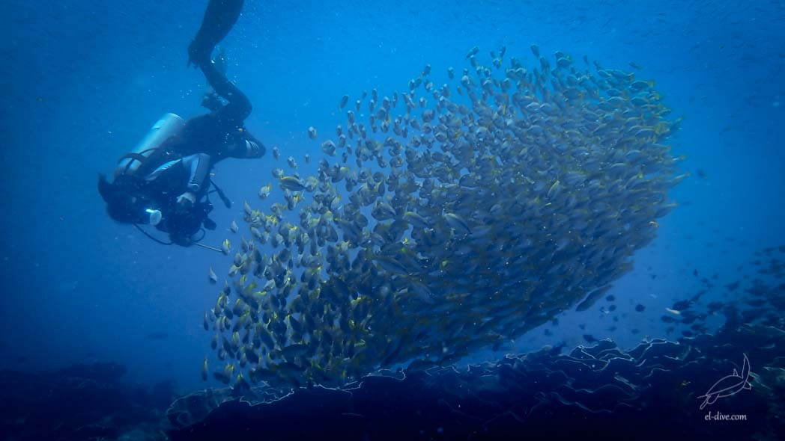

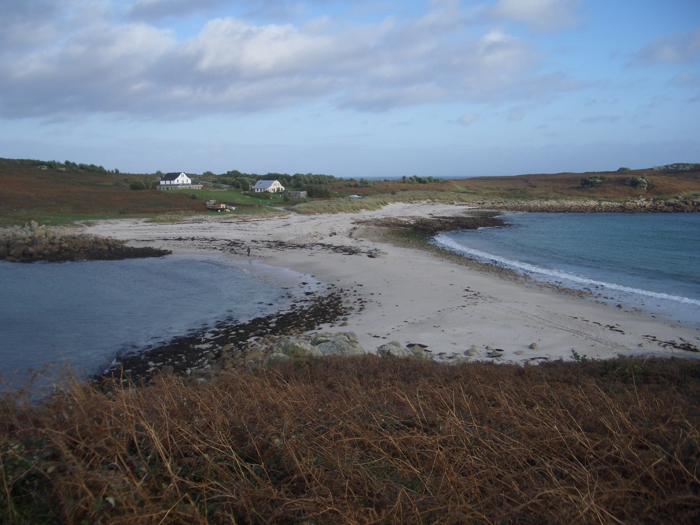

### frenzy
a state or period of uncontrolled excitement or wild behavior

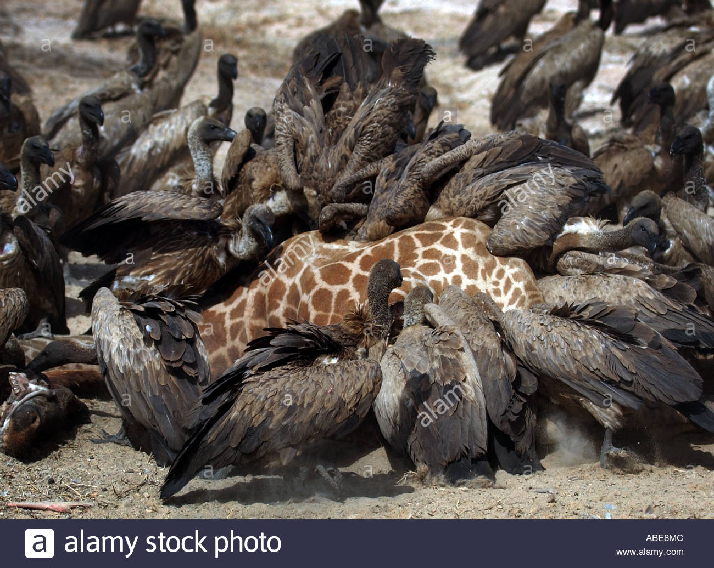

### sweep up

(Example)
- Every year, winds sweep up two billion tons of dust into the sky. At least a quarter of it eventually falls on the sea, providing nutrients needed by the microscopic organisms.

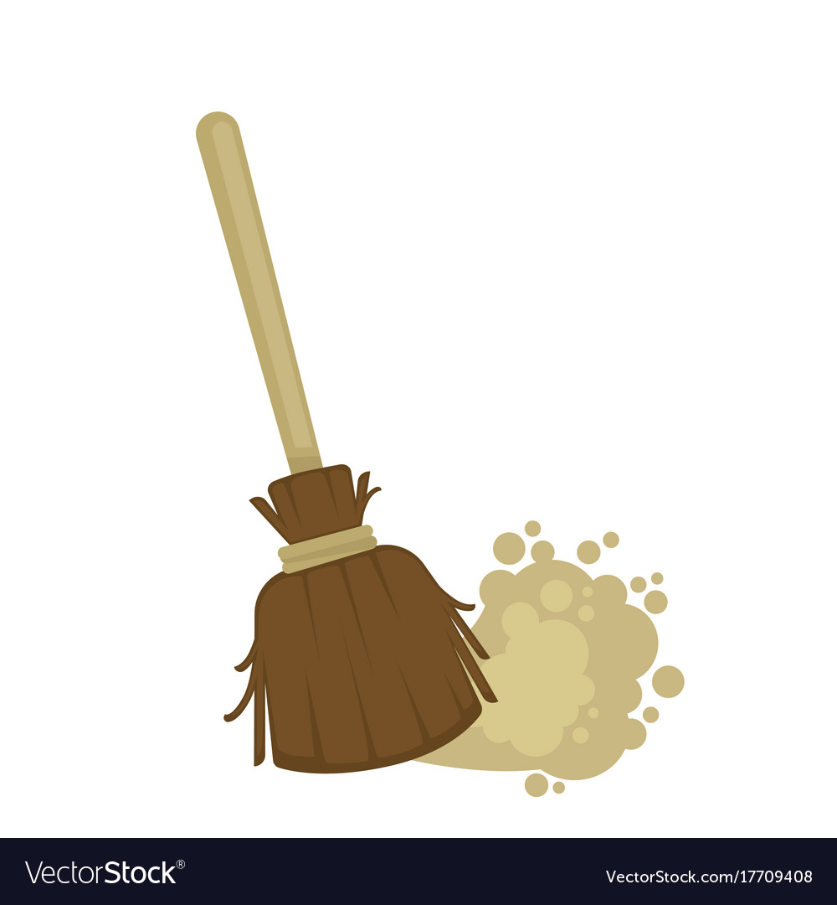

### mackerel
a shoal of mackerel
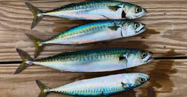

### krill
a swarm of krill

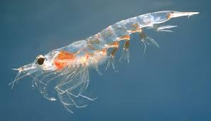

### crustaceans
an arthropod of the large, mainly aquatic group Crustacea, such as a crab, lobster, shrimp, or barnacle.

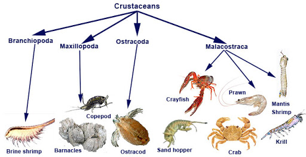

---
#### Etymology

Arthropoda: **phylum** of articulated invertebrates, 1849, Modern Latin, literally "those with jointed feet," coined 1845 by German zoologist Karl Theodor Ernst von Siebold (1804-1885) from Greek arthron "a joint" (from PIE root *ar- "to fit together") + podos genitive of pous "foot" (from PIE root *ped- "foot"). They comprise the vast majority of animals, including insects, spiders, and crustaceans.

invertebrates: an animal lacking a backbone, such as an arthropod, mollusk, annelid, coelenterate, etc. The invertebrates constitute an artificial division of the animal kingdom, comprising 95 percent of animal species and about 30 different phyla.

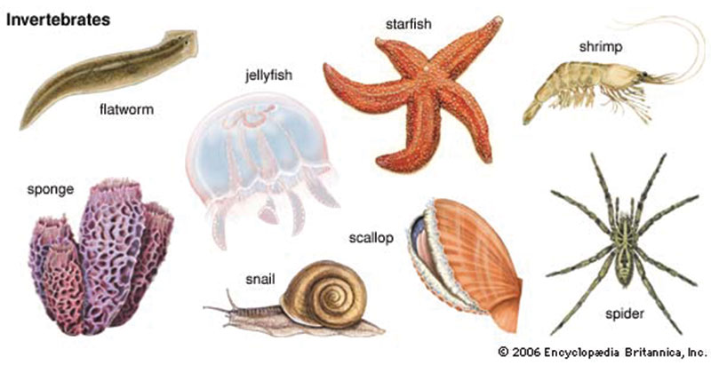

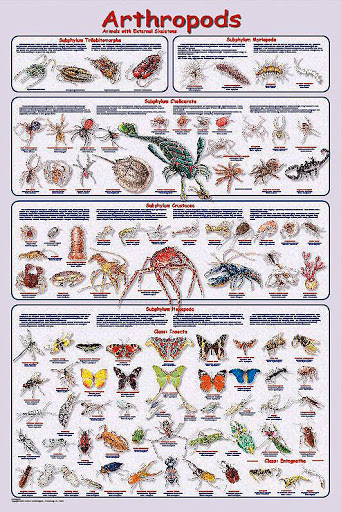

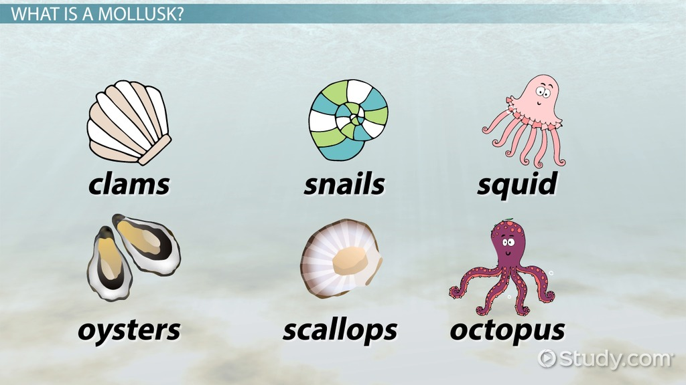

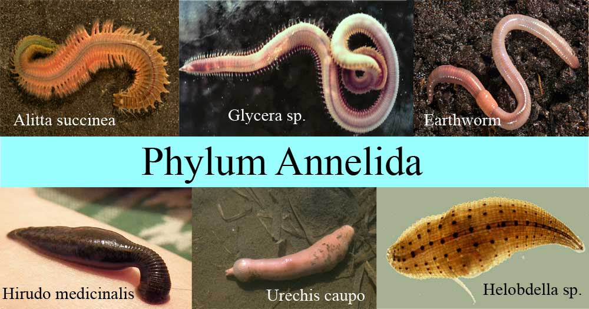

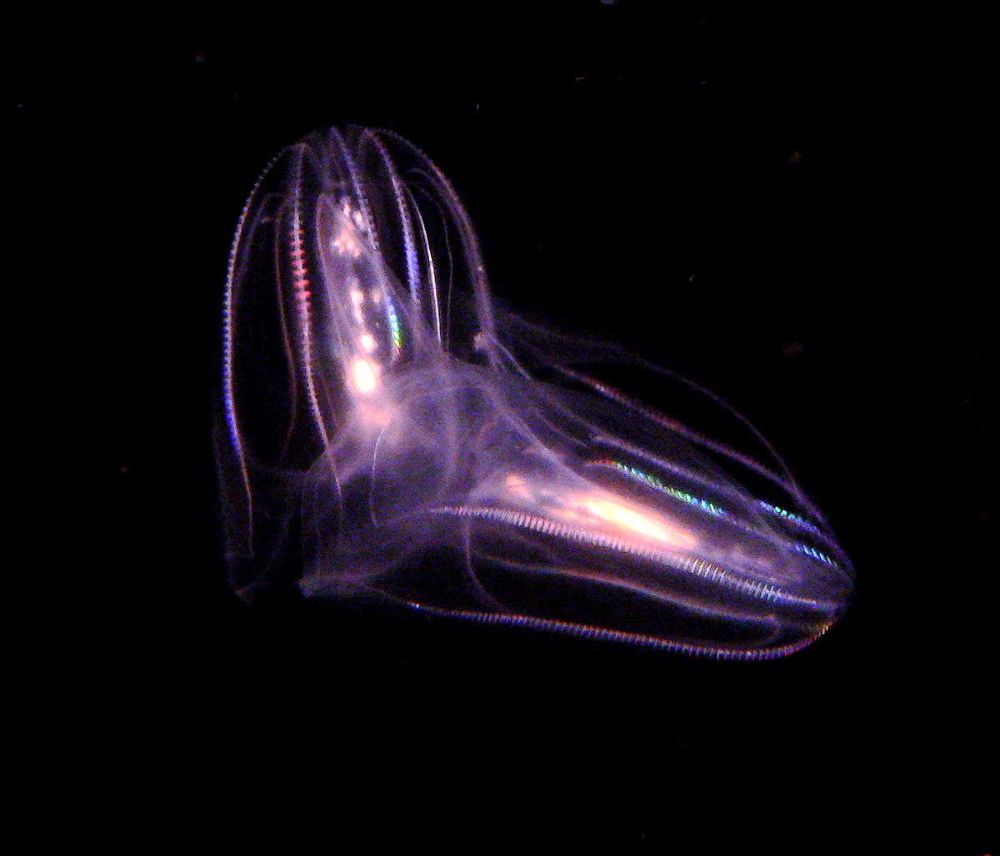

ar => also arə-, Proto-Indo-European root meaning "to fit together."

It forms all or part of: adorn; alarm; aristarchy; aristo-; aristocracy; arm (n.1) "upper limb of the body;" arm (n.2) "weapon;"

pod => Proto-Indo-European root meaning "foot."

---

### Salt pan
Natural salt pans or salt flats are flat expanses of ground covered with salt and other minerals, usually shining white under the sun.

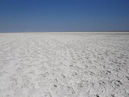

### deluge
1. a severe flood
2. inundate with a great quantity of something.

(Example)
- This may be the worst deluge in living memory.
- He has been deluged with offers of work.