[YouTube Link to Enjoy it](https://www.youtube.com/watch?v=gOsM-DYAEhY)

- Falling too fast to prepare for this
- Tripping in the world could be dangerous
- Everybody circling, it's **vulturous**
- Negative, **nepotist**
- Everybody waiting for the fall of man
- Everybody praying for the end of times
- Everybody hoping they could be the one
- I was born to run, I was born for this
- **Whip**, whip
- Run me like a racehorse
- **Pull me like a ripcord**
- Break me down and build me up
- I wanna be the **slip**, slip
- Word upon your lip, lip
- Letter that you rip, rip
- Break me down and build me up
- Whatever it takes
- 'Cause I love the adrenaline in my veins
- I do whatever it takes
- 'Cause I love how it feels when I break the chains
- Whatever it takes
- Yeah, take me to the top I'm ready for
- Whatever it takes
- 'Cause I love the adrenaline in my veins
- I do what it takes
- Always had a fear of being typical
- Looking at my body feeling **miserable**
- Always hanging on to the visual
- I wanna be invisible
- Looking at my years like a **martyrdom**
- Everybody needs to be a part of 'em
- Never be enough, I'm the **prodigal** son
- I was born to run, I was born for this
- Whip, whip
- Run me like a racehorse
- Pull me like a ripcord
- Break me down and build me up
- I wanna be the slip, slip
- Word upon your lip, lip
- Letter that you rip, rip
- Break me down and build me up
- Whatever it takes
- 'Cause I love the adrenaline in my veins
- I do whatever it takes
- 'Cause I love how it feels when I break the chains
- Whatever it takes
- Yeah, take me to the top, I'm ready for
- Whatever it takes
- 'Cause I love the adrenaline in my veins
- I do what it takes
- **Hypocritical**, **egotistical**
- Don't wanna be the **parenthetical**, **hypothetical**
- Working onto something that I'm proud of, out of the box
- An **epoxy** to the world and the vision we've lost
- I'm an **apostrophe**
- I'm just a symbol to remind you that there's more to see
- I'm just a product of the system, a catastrophe
- And yet a masterpiece, and yet I'm half-diseased
- And when I am deceased
- At least I go down to the grave and die happily
- Leave the body and my soul to be a part of thee
- I do what it takes
- Whatever it takes
- 'Cause I love the adrenaline in my veins
- I do whatever it takes
- 'Cause I love how it feels when I break the chains
- Whatever it takes
- Yeah, take me to the top, I'm ready for
- Whatever it takes
- 'Cause I love the adrenaline in my veins
- I do what it takes

### NEW WORDS

#### **Vulturous**: resembling a vulture especially in rapacity (= being rapacious (= living on prey)) or scavenging habits

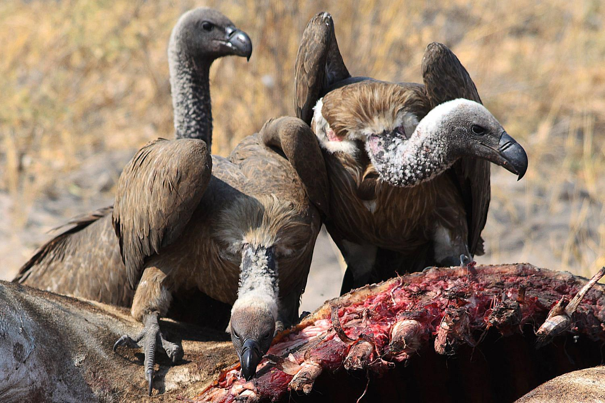

#### **Nepotist**: one who practices nepotism (= favoritism (as in appointment to a job) based on kinship)

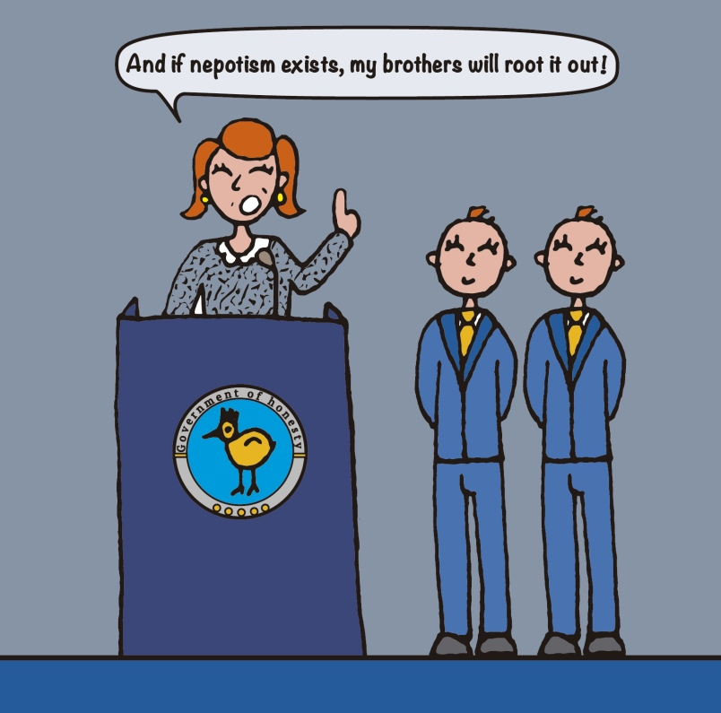

#### **Whip**: to beat with a whip

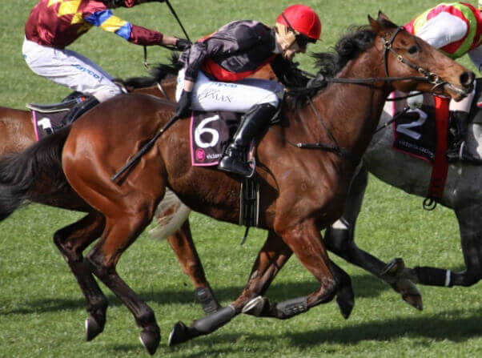

#### **Pulling the ripcord**

#### **Slip**: an act of sliding unintentionally for a short distance

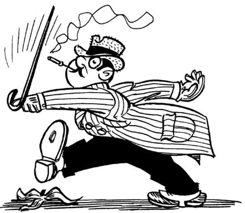

#### **Rip**: tear or pull (something) quickly or forcibly away from something or someone | (INFORMAL NORTH AMERICAN) scold or criticize harshly.

#### **Miserable**: (of a person) wretchedly unhappy or uncomfortable

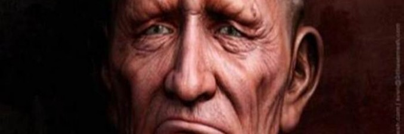

#### **Martyrdom**: the death or suffering of a martyr

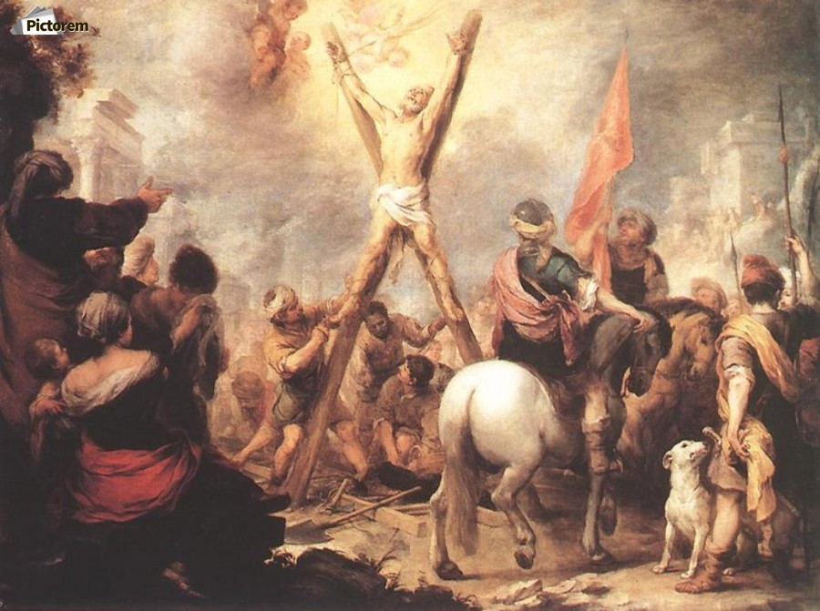

#### **Prodigal**: spending money or using resources freely and recklessly; wastefully extravagant | the prodigal son is a parable: In the story, a father has two sons. The younger son asks for his portion of inheritance from his father, who grants his son's request. This son, however, is prodigal (i.e., wasteful and extravagant), thus squandering his fortune and eventually becoming destitute. As consequence, he now must return home empty-handed and intend to beg his father to accept him back as a servant. To the son's surprise, he is not scorned by his father but is welcomed back with celebration and a welcoming party. Envious, the older son refuses to participate in the festivities. The father tells the older son: "you are ever with me, and all that I have is yours, but thy younger brother was lost and now he is found." [Wikipedia](https://en.wikipedia.org/wiki/Parable_of_the_Prodigal_Son#:~:text=The%20Parable%20of%20the%20Prodigal,a%20father%20has%20two%20sons.)

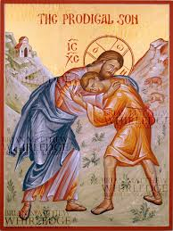

#### **Hypocritical**: behaving in a way that suggests one has higher standards or more noble beliefs than is the case.

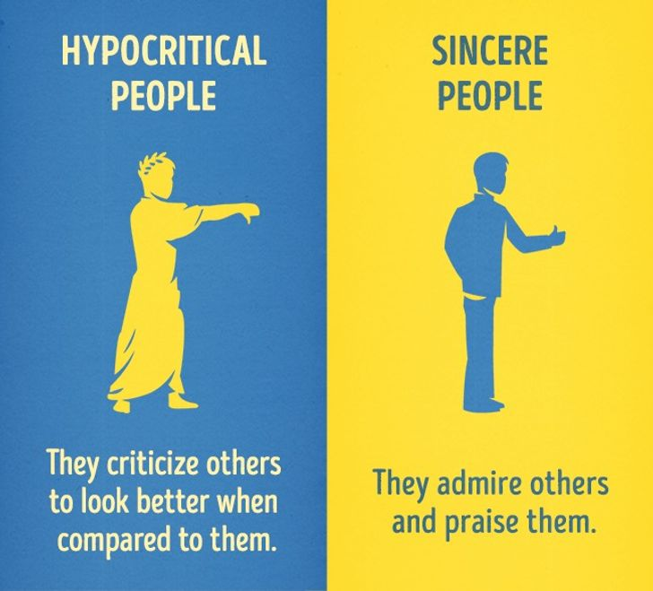

#### **egotistical**: excessively conceited or absorbed in oneself; self-centered.

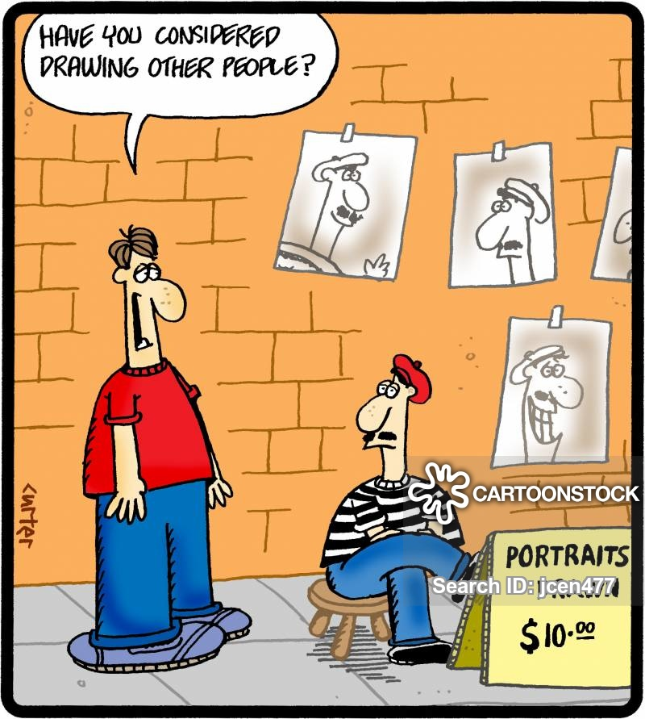

#### **parenthetical**: relating to or inserted as a parenthesis

#### **hypothetical**: of, based on, or serving as a hypothesis

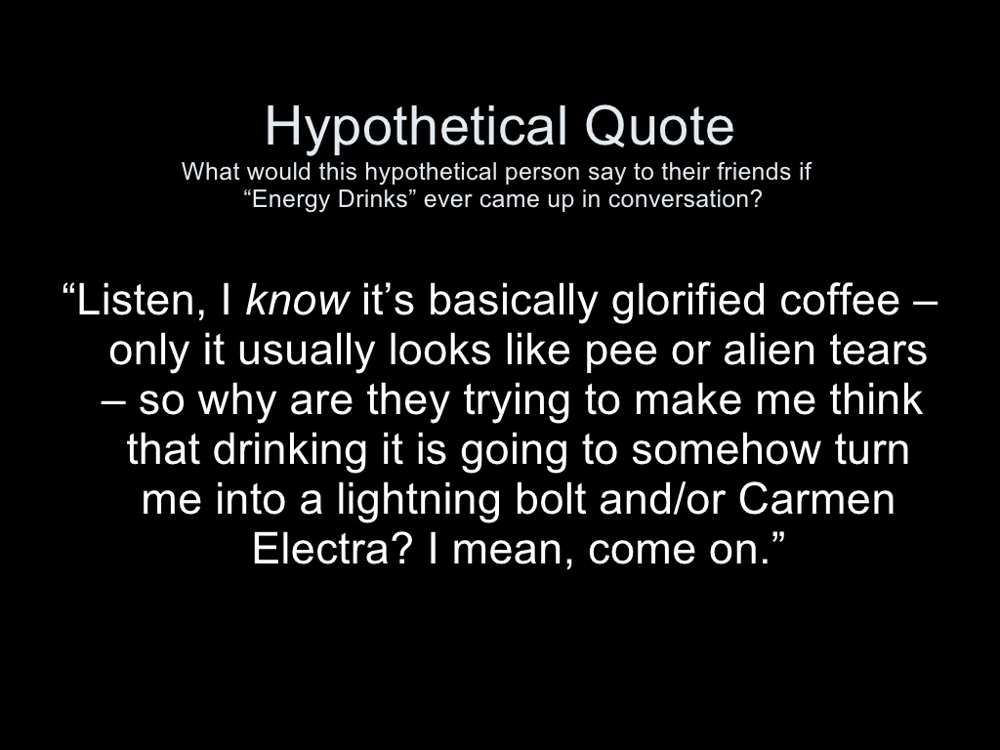

#### **epoxy**: any of a class of adhesives, plastics, or other materials that are polymers of epoxides.

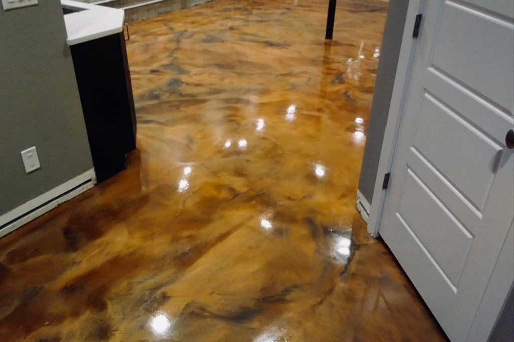

#### **apostrophe**: 
a punctuation mark ( ’ ) used to indicate either possession (e.g., Harry's book ; boys' coats ) or the omission of letters or numbers (e.g., can't ; he's ; class of ’99 ).

#### **deceased**: a person who has died

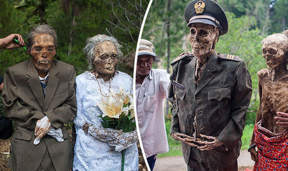