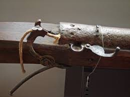
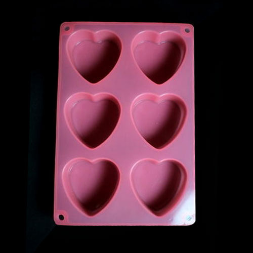
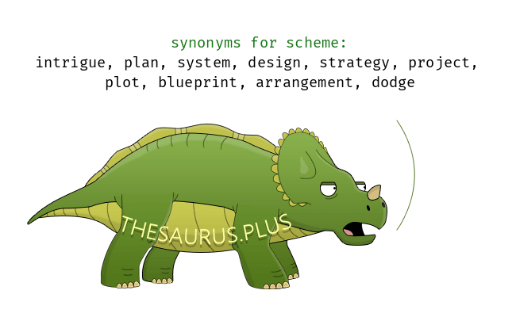
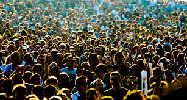
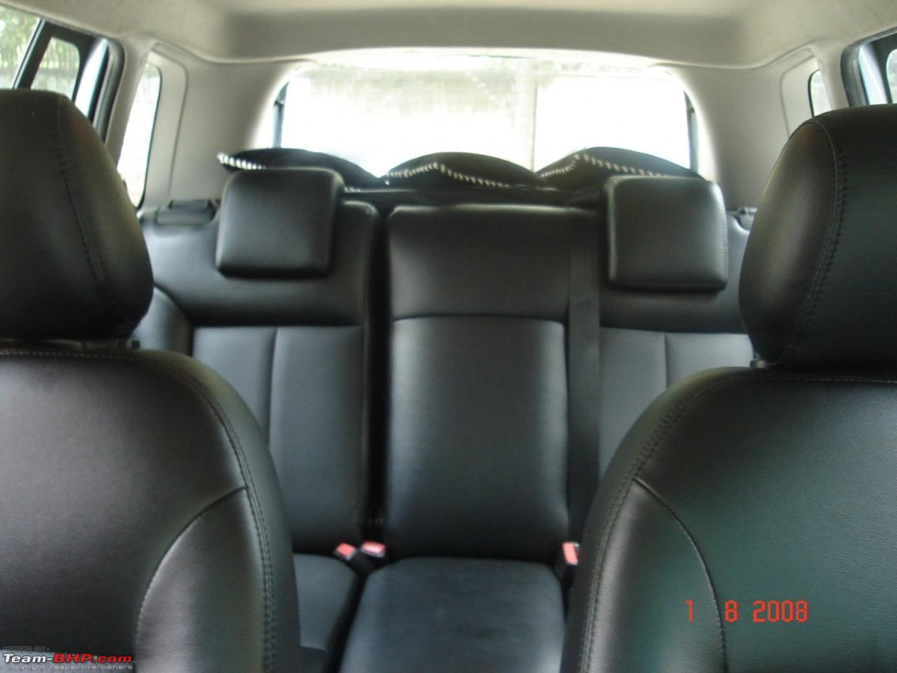

[YouTube Link to Enjoy it](https://www.youtube.com/watch?v=fKopy74weus)

- Just a young gun with a quick **fuse**
- I was **uptight**, wanna let **loose**
- I was dreaming of bigger things
- And wanna leave my own life behind
- Not a yes sir, not a follower
- Fit the box, fit the **mold**
- Have a seat in the **foyer**, take a number
- I was lightning before the thunder
- Thunder, thunder, thunder, thunder, th-th-thunder
- Thunder, thunder, thunder, th-th-thunder
- Thunder
- Thunder, feel the thunder
- Lightning then the thunder (thunder)
- Thunder, feel the thunder
- Lightning then the thunder
- Thunder, thunder
- Thunder
- Kids were laughing in my classes
- While I was **scheming** for the **masses**
- Who do you think you are?
- Dreaming 'bout being a big star
- They say you're basic, they say you're easy
- You're always riding in the **backseat**
- Now I'm smiling from the stage
- While you were **clapping in the nosebleeds**
- Thunder, thunder, thunder, th-th-thunder, thunder
- Thunder, thunder, thunder, th-th-thunder, thunder
- Thunder, feel the thunder
- Lightning then the thunder (thunder)
- Thunder, feel the thunder
- Lightning then the thunder
- Broke down on lonely highway
- So loud are the screams in my brain
- Oh, how I believed in my pain like you was my blood
- Looked back and I saw the dark clouds
- Took that and I made my mom proud
- It's easy to jump when you know how to fall (and, baby, I fall a lot)
- Don't wanna sit around and wait, just hanging on a fantasy
- I'm tryna be the kind of person who creates an energy
- I hope I got the storm inside to maybe make a better me
- Some people chalk it up to fate, I don't believe in destiny
- I guess I had a spark inside I couldn't light when I was younger
- Often times, I think you really need to fight to find the hunger
- Lightning is the shine, but I, I've been working on the thunder
- Thunder, thunder, thunder, th-th-thunder, thunder
- Thunder, thunder, thunder, th-th-thunder, thunder
- Thunder, feel the thunder
- Lightning then the thunder (thunder)
- Thunder, feel the thunder
- Lightning then the thunder

### NEW WORDS

##### Fuse
In military munitions, a fuze (sometimes fuse) is the part of the device that initiates function. In some applications, such as torpedoes, a fuze may be identified by function as the exploder.

##### uptight
anxious or angry in a tense and overly controlled way.

##### loose
not firmly or tightly fixed in place; detached or able to be detached

##### mold
a hollow container used to give shape to molten or hot liquid material when it cools and hardens

##### foyer
an entrance hall or other open area in a building used by the public, especially a hotel or theatre

##### Scheme
make plans, especially in a devious way or with intent to do something illegal or wrong

##### Mass
a large number of people or objects crowded together

##### backseat

##### nosebleeds

