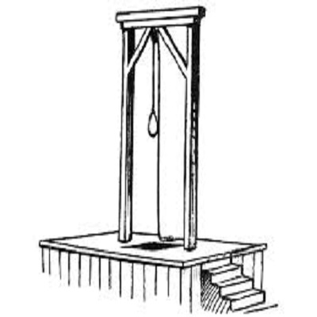
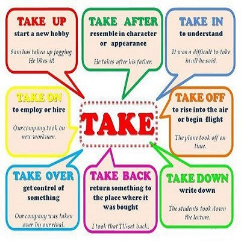
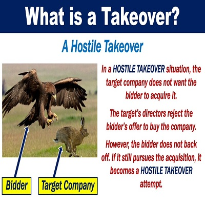

[YouTube Link to Enjoy it](https://www.youtube.com/watch?v=6Q0sMOQvJuw)

- Another head hangs lowly
- Child is slowly taken
- And the violence causes silence
- Who are we mistaken?

- But you see, it's not me
- It's not my family
- In your head, in your head, they are fighting
- With their tanks, and their bombs
- And their bombs, and their drones
- In your head, in your head, they are crying

- What's in your head, in your head
- Zombie, zombie, zombie
- What's in your head, in your head?
- Zombie, zombie, zombie

- Another mother's breaking
- Heart is taking over
- When the violence causes silence
- We must be mistaken

- It's the same old theme
- In 2018
- In your head, in your head, they're still fighting
- With their tanks, and their bombs
- And their guns, and their drones
- In your head, in your head, they are dying

- What's in your head, in your head?
- Zombie, zombie, zombie
- What's in your head, in your head?
- Zombie, zombie, zombie

- It's the same old theme
- In 2018
- In your head, in your head, they are dying

- What's in your head, in your head?
- Zombie, zombie, zombie
- What's in your head, in your head?
- Zombie, zombie, zombie

#### hanging

#### take over
assume control of something | become responsible for a task in succession to another
(Example)
1. in 1938 the Nazis took over
2. He will take over as chief executive in April.

