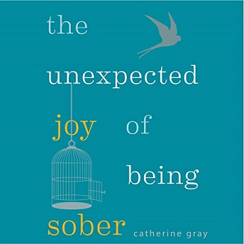

[YouTube Link to Enjoy it](https://www.youtube.com/watch?v=XUVtMNIux7M)

- For a moment I can wait
- It's a fight I guess I'll never know
- For a moment I can wait
- I'm holding on to hope
- And I know you're stoned, I can see it
- The struggle's getting old
- For a moment I can wait

- 'Cause you said you're **sober**
- Lying and I can't get closer
- Tell me should I let you go?
- Tell me should I let you go?
- 'Cause you said you're sober
- Lying and I can't get closer
- Tell me should I let you go?
- Tell me should I let you go?

- Every moment I'm awake
- It's a fight that you could never know
- Every moment I'm awake
- I'm clinging on to hope
- And I feel so low but I'm dealing
- The struggle's getting old
- Every moment I'm awake

- But I'm getting sober
- Trying but I can't get closer
- Baby did you let me go?
- Baby did you let me go?
- Now I'm getting sober
- Trying but I can't get closer
- Baby did you let me go?
-Baby did you let me go?
(Go)

- On and on we pray
- Thinking 'bout time and our mistakes
- Thinking 'bout time
- Thinking 'bout time
- 'Cause it's about time
(Go)

- On and on we pray
- Thinking 'bout time and our mistakes
- Thinking 'bout time
- Thinking 'bout time
- 'Cause it's about time
- ('Cause it's about time)

- So don't say it's over
- Waiting here while you get sober
- I'm never gonna let you go
- I'm never gonna let you go
- So don't say it's over
- Waiting here while you get sober
- I'm never gonna let you go
- I'm never gonna let you go
(Go)

- On and on we pray
- Thinking 'bout time and our mistakes
- Thinking 'bout time
- Thinking 'bout time
- 'Cause it's about time
('Cause it's about time)

- On and on we pray
- Thinking 'bout time and our mistakes
- Thinking 'bout time
- Thinking 'bout time
- It's about time

#### Sober
(adj) not affected by alcohol; not drunk.
(verb) make or become sober after drinking alcohol.

(Synonyms)

clearheaded, teetotal, dry, on the wagon, abstinent, abstemious

(Example)

that coffee sobered him up

