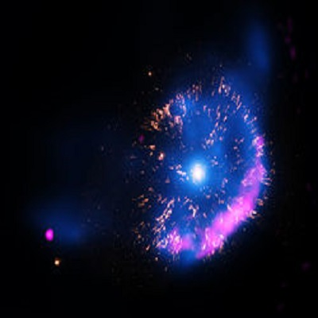
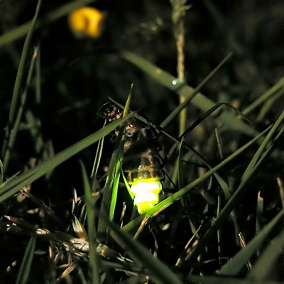

[YouTube Link to Enjoy it](https://www.youtube.com/watch?v=ScNNfyq3d_w)

- Take me down to the river bend
- Take me down to the fighting end
- Wash the poison from off my skin
- Show me how to be whole again
- Fly me up on a silver wing
- Past the black where the sirens sing
- Warm me up in a **nova**'s **glow**
- And drop me down to the dream below
- 'Cause I'm only a crack in this castle of glass
- Hardly anything there for you to see
- For you to see
- Bring me home in a blinding dream
- Through the secrets that I have seen
- Wash the sorrow from off my skin
- Show me how to be whole again
- 'Cause I'm only a crack in this castle of glass
- Hardly anything there for you to see
- For you to see
- 'Cause I'm only a crack in this castle of glass
- Hardly anything else I need to be
- 'Cause I'm only a crack in this castle of glass
- Hardly anything there for you to see
- For you to see
- For you to see

## NEW WORDS

#### Nova
a star showing a sudden large increase in brightness and then slowly returning to its original state over a few months.

#### Glow
(n) a steady radiance of light or heat.

(v) give out steady light without flame.

(Example)
1. the tips of their cigarettes glowed in the dark
2. the setting sun cast a deep red glow over the city
3. Glow-worms glow in the dark.

