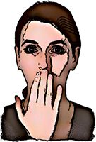
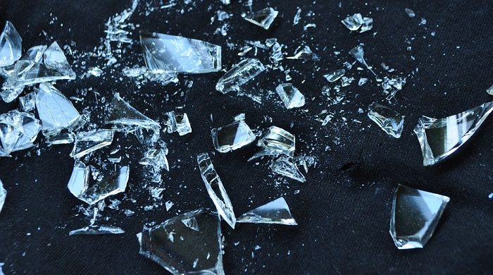

[YouTube Link to Enjoy it](https://www.youtube.com/watch?v=De-c6pT1biQ)

- All at once
- I finally **took a moment**
- And I'm realizing that
- You're not coming back
- And **it finally hit me**
- All at once
- All at once
- I started counting teardrops
- And at least a million fell
- My eyes began to **swell**
- And all my dreams were
- **Shattered** all at once
- Ever since I met you
- You're the only love I've known
- And I can't forget you
- Though I must face it all alone
- All at once
- I'm drifting on a lonely sea
- Wishing you'd come back to me
- And that's all that matters now
- All at once
- I'm drifting on a lonely sea
- Holding on to memories
- And it hurts me more than you know
- So much more than it shows
- All at once
- All at once
- I looked around and found
- That you were with another love
- In someone else's arms
- And all my dreams were shattered
- All at once
- All at once
- The smile that used to greet me
- Brightened someone else's day
- She took your smile away
- And left me with just memories
- All at once
- Ever since I met you
- You're the only love I've known
- And I can't forget you
- Though I must face it all alone
- All at once
- I'm drifting on a lonely sea
- Wishing you'd come back to me
- And that's all the matters now
- All at once
- I'm drifting on a lonely-sea
- Holding on to memories
- And it hurts me more than you know
- So much more than it shows
- All at once
- All at once
- I'm drifting on a lonely sea
- Wishing you'd come back to me
- And it hurts me more than you know
- So much more than it shows
- All at once
- And that's all the matters now
- All at once
- I'm drifting on a lonely sea
- Wishing you'd come back to me
- And it hurts me more than you know
- All at once

## NEW WORDS

#### Take a moment
to pause the current situation for a small amount of time

(Example)
1. I would like to take a moment and sit on the bench after my run.]
2. I would like to take a moment to thank my brother for planning this surprise birthday party for me.

#### It hit me
to have a sudden realization

Related Words:
1. appreciate
2. apprehend
3. assimilate
4. catch
5. discern
6. envision

#### Swell
to become larger and rounder than usual; to (cause to) increase in size or amount

(Example)
1. It was obvious she had broken her toe, because it immediately started to swell (up).
2.  His heart/breast swelled with pride (= he felt very proud) as he stood watching his son graduate.

#### Shatter
to (cause something to) break suddenly into very small pieces

(Example)
1. The glass shattered into a thousand tiny pieces.
2. His leg was shattered in the accident.

#### Drift
to move slowly, especially as a result of outside forces, with no control over direction

(Example)
1. No one noticed that the boat had begun to drift out to sea.
2. After the band stopped playing, people drifted away in twos and threes.